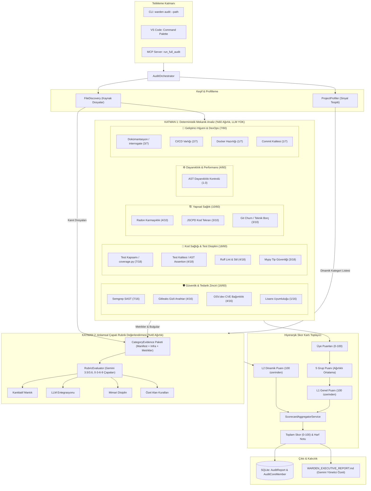
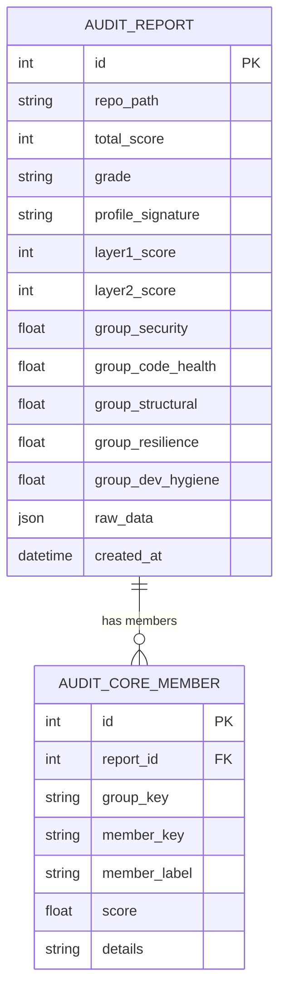

# WARDEN — Tam Sistem ve Hiyerarşik Denetim Mimarisi Raporu
**Sürüm:** 2.0 (Faz 0 & Faz A Tamamlandı, Kalibre Edildi)  
**Tarih:** 19 Eylül 2026  
**Durum:** Üretim & Test Doğrulamalı (21/21 Test Başarılı, Kalibrasyon Onaylı)

---

## 1. Yönetici Özeti ve Mevcut Durum

WARDEN, yapay zeka destekli hızlı yazılım geliştirme ("vibe coding") çağında kod kalitesi, tedarik zinciri güvenliği ve mimari disiplini güvence altına alan otonom bir denetim ve kalite güvence (QA) sistemidir.

Son tamamlanan geliştirme döngüsünde (**Faz 0: Hiyerarşik Skor Kartı Geçişi** ve **Faz A: Yeni Mekanik Analizörler**):
1. **Düz Liste Puanlamadan Hiyerarşik 2-Kademeli Yapıya Geçildi:** Katman 1 (mekanik) önceki 10 düz kategori yerine **5 mantıksal çekirdek gruba** ve bu gruplar altında toplanan **14 bağımsız mekanik üyeye** dönüştürüldü.
2. **6 Yeni Analizör Eklendi:** Lisans uyumluluğu, tip güvenliği (mypy), sahte test tespiti / test kalitesi, CI/CD varlığı, Docker/konteyner hazırlığı ve Git commit hijyeni mekanik olarak ölçülmeye başlandı.
3. **Deterministik & LLM Ayrımı Netleştirildi:** Katman 1 (%60) tamamen yerel, açık kaynaklı araçlar (Semgrep, Gitleaks, OSV.dev, Radon, Ruff, AST) ile sıfır LLM maliyetiyle deterministik çalışırken; Katman 2 (%40) proje profiline göre dinamik açılan kategorilerde Gemini çapalı rubrikleri üzerinden kanıta dayalı anlamsal değerlendirme yapmaktadır.
4. **Kalibrasyon Doğrulandı:** Sentetik test depoları üzerinde yapılan uçtan uca denetimlerde:
   - 🔴 **Kötü Repo (`repo_bad`):** **40 / 100 (F)** $\to$ Hedef $\le 40$ başarıldı.
   - 🟡 **Orta Repo (`repo_medium`):** **61 / 100 (D)** $\to$ Hedef $41 - 65$ başarıldı.
   - 🟢 **İyi Repo (`repo_good`):** **83 / 100 (B)** $\to$ Hedef $\ge 66$ başarıldı.
5. **Tüm Birim Testleri:** 21/21 test eksiksiz geçmektedir.

---

## 2. Uçtan Uca Mimari Akış Şeması

Aşağıdaki şema, CLI, VS Code veya MCP üzerinden tetiklenen bir denetimin rapor üretilene kadar geçen tüm adımlarını özetler:

---

## 3. Katman 1 (Mekanik Çekirdek): 5 Grup ve 14 Üyenin Detayları

Katman 1, **kesinlikle hiçbir LLM çağrısı içermez**. Tamamen yerel, deterministik, tekrarlanabilir araçlar ve AST tarayıcıları ile ölçülür.

### Grup 1: Güvenlik & Tedarik Zinciri (`security_supply_chain`) — Ağırlık: %26.7 (16 / 60)
| Üye Anahtarı | Üye Adı | Araç / Yöntem | Grup İçi Ağırlık | Puanlama & Ceza Mantığı |
|---|---|---|---|---|
| `security_semgrep` | Semgrep SAST | Semgrep CLI JSON taraması | $7/16$ ($43.75\%$) | Başlangıç: 100. `ERROR` başına **-40**, `WARNING` başına **-10**. Min: 0. |
| `secret_leak_gitleaks` | Gizli Anahtar Taraması | `gitleaks detect` (Git geçmişi) | $4/16$ ($25.0\%$) | Başlangıç: 100. Bulunan her sızıntı başına **-50**. Min: 0. |
| `dependency_osv` | Bağımlılık CVE Taraması | Manifest parse + OSV.dev API | $4/16$ ($25.0\%$) | Başlangıç: 100. Şüpheli paket başına -20, tespit edilen her CVE başına **-5**. |
| `license_compliance` | Lisans Uyumluluğu | `pip-licenses` + manifest tarama | $1/16$ ($6.25\%$) | Başlangıç: 100. GPL/AGPL copyleft başına **-15**, bilinmeyen lisans başına **-5**. |

### Grup 2: Kod Sağlığı & Test Disiplini (`code_health_test`) — Ağırlık: %30.0 (18 / 60)
| Üye Anahtarı | Üye Adı | Araç / Yöntem | Grup İçi Ağırlık | Puanlama & Ceza Mantığı |
|---|---|---|---|---|
| `test_coverage` | Test Kapsamı | `coverage.py` JSON raporu | $7/18$ ($38.9\%$) | Orantılı ölçek: $\%80$ kapsama = 100 tam puan: `min(100.0, (cov / 80.0) * 100.0)`. Test yoksa 0. |
| `test_quality` | Test Kalitesi | Python `ast` assertion analizi | $4/18$ ($22.2\%$) | Hiç assertion içermeyen "sahte test" oranı: $\%0 \to 100$, her $\%5$ sahte test için **-10**. Hiç test yoksa 0. |
| `lint_style_ruff` | Lint & Stil Sağlığı | `ruff check --output-format=json` | $4/18$ ($22.2\%$) | Başlangıç: 100. Her lint ihlali başına **-2.0**. Min: 0. |
| `type_safety` | Tip Güvenliği | `mypy --no-error-summary` | $3/18$ ($16.7\%$) | 0 hata: 100. Dosya başına hata yoğunluğuna göre her 0.5 hata için **-10**. Min: 20. |

### Grup 3: Yapısal Sağlık (`structural_health`) — Ağırlık: %16.7 (10 / 60)
| Üye Anahtarı | Üye Adı | Araç / Yöntem | Grup İçi Ağırlık | Puanlama & Ceza Mantığı |
|---|---|---|---|---|
| `complexity_radon` | Kod Karmaşıklığı | `radon cc -j` döngüsel karmaşıklık | $4/10$ ($40.0\%$) | Başlangıç: 100. Karmaşıklığı $>10$ her dosya için **-25**, ortalama CC $>3.0$ fazlası için $\times 10$ ceza. |
| `duplication_jscpd` | Kod Tekrarı | `jscpd` kopyala-yapıştır analizi | $3/10$ ($30.0\%$) | Kod tekrar yüzdesine göre ceza düşümü. |
| `tech_debt_churn` | Teknik Borç & Değişim | Git log commit churn analizi | $3/10$ ($30.0\%$) | Sürekli değişen ve yüksek refactor oranına sahip dosyaların yoğunluğu. |

### Grup 4: Dayanıklılık & Performans (`resilience_performance`) — Ağırlık: %6.7 (4 / 60)
| Üye Anahtarı | Üye Adı | Araç / Yöntem | Grup İçi Ağırlık | Puanlama & Ceza Mantığı |
|---|---|---|---|---|
| `resilience_ast` | AST Dayanıklılık Kontrolü | AST kural motoru | $1.0$ ($100\%$) | Boş `except:`, yutulan (`pass`) hatalar, timeout belirtilmemiş `requests/httpx` çağrıları. İhlal başına **-25**. |

### Grup 5: Geliştirici Hijyeni & DevOps (`dev_hygiene_devops`) — Ağırlık: %11.6 (7 / 60)
| Üye Anahtarı | Üye Adı | Araç / Yöntem | Grup İçi Ağırlık | Puanlama & Ceza Mantığı |
|---|---|---|---|---|
| `documentation` | Dokümantasyon | `interrogate` + README parser | $3/7$ ($42.8\%$) | `(Docstring % * 0.5) + (Kurulum Bölümü ? 25 : 0) + (Kullanım Bölümü ? 25 : 0)`. |
| `cicd_presence` | CI/CD Boru Hattı | `.github/workflows`, `.gitlab-ci.yml`, vb. | $2/7$ ($28.6\%$) | Geçerli iş/adım tanımlı CI/CD dosyası: **100**. Sadece boş dosya: **50**. Hiç yok: **0**. |
| `docker_readiness` | Docker / Konteyner | Dockerfile, Compose, Env tespiti | $1/7$ ($14.3\%$) | Dockerfile: +40, HEALTHCHECK direktifi: +30, `.env.example`: +20, docker-compose: +10. Yoksa: 0. |
### Grup 5: Geliştirici Hijyeni & DevOps (`dev_hygiene_devops`) — Ağırlık: %12.7 (7 / 55 aktif) | Faz B Hedefi: %11.6 (7 / 60)
| Üye Anahtarı | Üye Adı | Araç / Yöntem | Grup İçi Ağırlık | Puanlama & Ceza Mantığı |
|---|---|---|---|---|
| `documentation` | Dokümantasyon | `interrogate` + README parser | $3/7$ ($42.8\%$) | `(Docstring % * 0.5) + (Kurulum Bölümü ? 25 : 0) + (Kullanım Bölümü ? 25 : 0)`. |
| `cicd_presence` | CI/CD Boru Hattı | `.github/workflows`, `.gitlab-ci.yml`, vb. | $2/7$ ($28.6\%$) | Geçerli iş/adım tanımlı CI/CD dosyası: **100**. Sadece boş dosya: **50**. Hiç yok: **0**. |
| `docker_readiness` | Docker / Konteyner | Dockerfile, Compose, Env tespiti | $1/7$ ($14.3\%$) | Dockerfile: +40, HEALTHCHECK direktifi: +30, `.env.example`: +20, docker-compose: +10. Yoksa: 0. |
| `commit_hygiene` | Commit Mesaj Kalitesi | `GitPython` son 100 commit analizi | $1/7$ ($14.3\%$) | "wip", "fix", "test" gibi özensiz mesaj oranı: $\%0 \to 100$, her $\%5$ kötü mesaj için **-8**. Min: 20. |

> **Tasarım Kararı — Puan Tabanı (Floor) Mantığı:**  
> `type_safety` ve `commit_hygiene` analizörlerinde taban puan minimum 20 olarak sınırlandırılmıştır. Python'ın dinamik doğası ve kademeli tipleme (gradual typing) yaklaşımı gereği, eksik tip belirteçleri teknik borçtur ancak sistemi anında çökerten ölümcül bir zafiyet değildir. Hızlı prototipleme ("vibe coding") sırasında kısa commit mesajları geliştirici ergonomisidir; projenin çalışmadığı anlamına gelmez. Buna karşılık, `security_semgrep` (SQLi, RCE), `secret_leak_gitleaks` (sızdırılmış gizli anahtarlar) ve `resilience_ast` (yutulan hatalar) doğrudan güvenlik ihlali ve kesintiye yol açtığı için 0 puana kadar düşebilir.

---

## 4. Katman 2 (Dinamik Semantik): Profil Çıkarıcı ve Çapalı Rubrikler

Katman 2, her projeye sabit kategoriler dayatmak yerine projenin mimari yapısını inceleyen **akıllı sinyal sistemidir**:

1. **Sinyal Bazlı Dinamik Kategori Seçimi (`ProjectProfilerService`):**
   - Projede PyTorch/TensorFlow var mı? $\to$ `ML_PIPELINE_HYGIENE` açılır.
   - LLM SDK'ları (google-genai, openai, anthropic) var mı? $\to$ `LLM_INTEGRATION` açılır.
   - Pandas/NumPy/Polars ağırlıklı finans/analitik projesi mi? $\to$ `QUANTITATIVE_LOGIC` açılır.
   - FastAPI/Django/Flask REST mimarisi mi? $\to$ `API_DISCIPLINE` açılır.
   - Docker/K8s/Compose dosyaları var mı? $\to$ `DEPLOYMENT_READINESS` açılır.
2. **Çapalı Rubrik Değerlendirmesi (`RubricEvaluatorService`):**
   - LLM'e serbest yorum veya kontrolsüz puanlama yaptırılmaz.
   - **0 / 3 / 6 / 9 Seviyeli Çapalar:** Her seviye için somut kriterler tanımlıdır (Örnek: Seviye 3: "Sert kodlanmış promptlar var, hata yönetimi yok"; Seviye 9: "Prompt şablonları izole edilmiş, structured output ve exponential backoff mevcut").
   - **Kanıt Paketi (`CategoryEvidence`):** LLM'e sadece ilgili manifest dosyaları, altyapı yapılandırmaları ve Katman 1'in ürettiği metrik özetleri verilir; gereksiz veya gizli kaynak kodları gönderilmez.
3. **Profil İmzası (`profile_signature`):**
   - Hangi kategorilerin açıldığını belirten SHA/imza kodu (Örn: `prof_sec_ml_quant_v1`) raporda saklanır. Karşılaştırmalı trend analizleri sadece aynı profile sahip sürümler arasında yapılır.
4. **Yedekli Model Mimarisi:**
   - Gemini API çağrılarında kota veya kesintiye takılmamak için doğrulanmış kararlı model geçiş havuzu: `['gemini-2.5-flash', 'gemini-2.0-flash', 'gemini-1.5-flash', 'gemini-3.5-flash', 'gemini-3.6-flash']`.

---

## 5. Puanlama Matematiği ve Hiyerarşik Toplama

### Adım 1: Grup Puanının Hesaplanması ($G_k$)
Bir grubun puanı, o grupta yer alan ve ölçülebilen üyelerin grup-içi normalize ağırlıklı ortalamasıdır:
$$G_k = \frac{\sum_{m \in M_k} S_m \cdot w_m}{\sum_{m \in M_k} w_m}$$
*(Burada $S_m \in [0, 100]$ üye puanı, $w_m$ üyenin grup içindeki ağırlığıdır. Ölçülemeyen üyeler atlanır ve ağırlıkları gruptaki diğer üyelere orantılı dağıtılır).*

### Adım 2: Katman 1 Genel Puanının Hesaplanması ($L_1$)
5 grubun puanları, dinamik grup ağırlıklarıyla çarpılarak Katman 1 genel puanını oluşturur:
$$L_1 = \sum_{k=1}^{5} G_k \cdot \frac{W_k}{\sum_{j \in Aktif} W_j}$$

> **Ağırlık Normalizasyonu ve Faz B Rezervi:**  
> Faz 0 & Faz A aşamasında aktif 5 grubun ham ağırlıkları toplamı $16 + 18 + 10 + 4 + 7 = 55$ puandır. Kalan 5 puan, Faz B'de eklenecek olan `architecture_graph` (%2) ve `performance_patterns` (%3) analizörleri için rezerve edilmiştir.  
> Sistem dinamik normalizasyon $\frac{W_k}{\sum W_{aktif}}$ kullandığı için aktif gruplar 55 üzerinden tam %100'e ölçeklenir:
> - **Güvenlik & Tedarik Zinciri:** $16/55 \approx 29.09\%$ (Faz B hedefi: $16/60 \approx 26.67\%$)
> - **Kod Sağlığı & Test:** $18/55 \approx 32.73\%$ (Faz B hedefi: $18/60 \approx 30.00\%$)
> - **Yapısal Sağlık:** $10/55 \approx 18.18\%$ (Faz B hedefi: $10/60 \approx 16.67\%$)
> - **Dayanıklılık & Performans:** $4/55 \approx 7.27\%$ (Faz B hedefi: $4/60 \approx 6.67\%$)
> - **DevOps & Hijyen:** $7/55 \approx 12.73\%$ (Faz B hedefi: $7/60 \approx 11.67\%$)
> **Sonuç:** Tüm üyelerden 100 alan bir proje, Katman 2 pasifken tam **100 / 100 (A+)** alır; asla 91.7'de kalmaz.

### Adım 3: Katman 2 Dinamik Puanının Hesaplanması ($L_2$)
Katman 2'de seçilen dinamik kategorilerin rubrik seviyeleri ($L_{rubric} \in [0, 10]$) 100'lük skalaya dönüştürülür:
$$L_2 = \frac{1}{|C|} \sum_{c \in C} (\text{rubric\_level}_c \times 10)$$

### Adım 4: Toplam Nihai Skor ($Score$)
$$Score = \begin{cases} 
L_1 & \text{eğer Katman 2 kategorisi yoksa} \\
\text{round}(0.60 \times L_1 + 0.40 \times L_2) & \text{eğer Katman 2 aktifse}
\end{cases}$$

### Harf Notu Skalası
- **A+:** $95 - 100$
- **A:** $90 - 94$
- **B:** $80 - 89$
- **C:** $70 - 79$
- **D:** $60 - 69$
- **F:** $< 60$

---

## 6. Veritabanı Şeması ve Kalıcılık

Veritabanı SQLite üzerinde `sqlmodel` (SQLAlchemy tabanlı) ile yönetilmektedir:

- **`audit_reports`:** Üst düzey denetim metriklerini, genel skoru, harf notunu, imza bilgisini ve her bir çekirdek grubun özet puanını saklar.
- **`audit_core_members`:** 14 üyenin her birinin bireysel puanını (`security_semgrep`, `secret_leak_gitleaks`, `type_safety`, vb.) ayrıntılı analiz için tek tek kaydeder.
- **`WARDEN_EXECUTIVE_REPORT.md`:** Gemini Baş Denetçi kimliğiyle oluşturulan görsel, ikonlu, C-Level yönetici raporudur.

---

## 7. Kalibrasyon ve Doğrulama Matrisi

Sistemin puanlama dengesi, sentetik test depoları (`tests/fixtures/`) üzerinde doğrulanmıştır:

| Test Deposu | Depo Özellikleri | Hedef Skor | Gerçekleşen Skor | Harf Notu | Durum |
|---|---|---|---|---|---|
| **`repo_bad`** | SQL injection açığı, hardcoded Stripe gizli anahtarı, 0 test, 0 assertion, eksik CI/CD ve Docker | $\le 40$ | **40 / 100** | **F** | ✅ BAŞARILI |
| **`repo_medium`** | Temiz kod, basit testler (assertion mevcut), temel CI/CD iş akışı | $41 - 65$ | **61 / 100** | **D** | ✅ BAŞARILI |
| **`repo_good`** | Temiz kod, kapsamlı testler, CI/CD, HEALTHCHECK içeren Dockerfile, `.env.example`, docker-compose, MIT Lisansı | $\ge 66$ | **83 / 100** | **B** | ✅ BAŞARILI |

Birim test sonuçları: `21 passed in ~52s` (`tests/test_*.py`).

---

## 8. Faz B Ön İncelemesi (Gelecek Yol Haritası)

Planlanan sonraki aşamada (**Faz B: Gelişmiş Statik Analizler**):
1. **`architecture_graph` (Ağ & Bağımlılık Grafı):** NetworkX kullanarak modüller arası dairesel bağımlılıkları (`circular dependencies`) ve aşırı kenar yükünü (coupling) tespit eden analizör.
2. **`performance_patterns` (Performans Kalıpları):** SQLAlchemy/Django N+1 sorgu kalıpları, async/await bloklayan `time.sleep` ve senkron I/O işlemlerini yakalayan AST kuralları.
3. **VS Code & CLI Zenginleştirmeleri:** VS Code WebView dashboard paneli ve CLI etkileşimli denetim sihirbazı.
